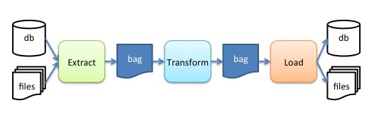

# Design

This is a minimal, conceptual design. This should not be taken too literally.
For example, the ETL steps may be recomposed in different orders, may or may not
be called sequentially, overall execution could be implemented with message
queueing and load balancing in between the utilities, et cetera, et cetera. This
document is only intended to give the reader a general, conceptual overview of
the basic logical flow of the IObox utilities.

## Overview

The classic [Extract Transform Load (ETL)](https://en.wikipedia.org/wiki/Extract,_transform,_load)
concept is a simple frame of reference for IObox.

**Fig 1.** Overview diagram

In figure 1, an idealized data flow is depicted from data sources, through the
ETL steps, to the data sinks.

* **Extract**: is a step that takes in arbitrarily formatted data and produces a data
package in the [Beanbag format](./bags.md).
* **Transform**: is a step that takes a *Beanbag* package, executes transformations
on the contents of the package, and produces a derived *Beanbag* package.
* **Load**: is a step that takes a *Beanbag* package, and loads the contents into an
arbitrarily formatted data sink.

### There can be only one?

No. In fact, the important point is that the above design encourages modularity
and specifies only a common data interchange format (the *Beanbag* format).

So, there will be more than one *Extract* utility in the IObox suite. For
instance,

* `mssql2bb`: a utility that connects to a Microsoft SQLServer and executes one or
more Structured Query Language (SQL) query statements, and produces a beanbag
package.
* `xml2bb`: a similar utility that reads source data from eXtensible Markup
Language (XML) input files.
* `dams2bb`: a utility that reads source data from ERMrest and Hatrac and
produces a *Beanbag* package.

Our current plan for the *Transform* utility is:

* `bb2bb-sql`: a utility that reads a *Beanbag* package, loads a sqlite
database, runs user-specified SQL script(s) to transform the local database, and
exports the transformed data as a new package.
* other: we envision other transformation utilities that will utilize machine
learning (ML) tools.

Similarly, the *Load* utility will include at least one tool:

* `bb2dams`: a utility that reads a *Beanbag* package, resolves remote references
to files, updates table data columns that reference assets, loads assets in a
Hatrac object store, and loads the table data in an ERMrest store.
* alternatives: one can expect alternative load utilities that load other data
management systems, such as institutional repositories, public repositories, and
other endpoints.

### Coordinating the utilities

Many use cases will require some custom process which recombines these utilities
in different combinations and sequences. The modularity of the design is needed
in order to support various processes. However, the design also permits the
development of wrappers that combine the utilities for the most common sequences
(as yet to be determined).
